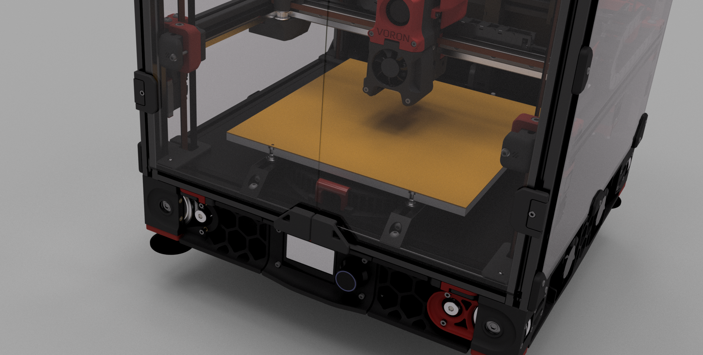

<!--
*** Thanks for checking out the Best-README-Template. If you have a suggestion
*** that would make this better, please fork the repo and create a pull request
*** or simply open an issue with the tag "enhancement".
*** Thanks again! Now go create something AMAZING! :D
-->

<!-- PROJECT SHIELDS -->
<!--
*** I'm using markdown "reference style" links for readability.
*** Reference links are enclosed in brackets [ ] instead of parentheses ( ).
*** See the bottom of this document for the declaration of the reference variables
*** for contributors-url, forks-url, etc. This is an optional, concise syntax you may use.
*** https://www.markdownguide.org/basic-syntax/#reference-style-links
-->

<!-- PROJECT LOGO -->
 

  <https://github.com/0ndsk4/VoronUsers/tree/0ndsk4/printer_mods/0ndsk4/Nevermore_Air_Filter/Nevermore_Micro/">
    
  </a>

  <h3 align="center">Nevermore Air Filter</h3>

  

    But the Raven, sitting lonely on the placid bust, spoke only 
That one word, as if his soul in that one word he did outpour. 
    Nothing farther then he uttered—not a feather then he fluttered— 
    Till I scarcely more than muttered “Other friends have flown before— 
On the morrow he will leave me, as my Hopes have flown before.” 
            Then the bird said “Nevermore.”!  
			<B>"The Raven"</b>, Edgar Allan Poe
     
 
	  
    <https://github.com/0ndsk4/VoronUsers/tree/0ndsk4/printer_mods/0ndsk4/Nevermore_Air_Filter/Nevermore_Micro"><strong>Explore the Nevermore »</strong></a>
     
     
    <a href="https://github.com/0ndsk4/VoronUsers/tree/0ndsk4/printer_mods/0ndsk4/Nevermore_Air_Filter/Nevermore_Micro">Nevermore Air Filter</a>
    ·
    <a href="https://github.com/0ndsk4/VoronUsers/tree/0ndsk4/printer_mods/0ndsk4/Nevermore_Air_Filter/Nevermore_Micro/issues">Report Bug</a>
    ·
    <a href="https://github.com/0ndsk4/VoronUsers/tree/0ndsk4/printer_mods/0ndsk4/Nevermore_Air_Filter/Nevermore_Micro/issues">Request Feature</a>
  

<!-- TABLE OF CONTENTS -->

  
Table of Contents

  <ol>
    <li>
      <a href="#About-The-Nevermore">About The Nevermore</a>
      <ul>
        <li><a href="#Why">Why Nevermore?</a></li>
      </ul>
    </li>
    <li>
      <a href="#getting-started">Getting Started</a>
      <ul>
        <li><a href="#BOM">BOM</a></li>
        <li><a href="#installation">Installation</a></li>
		<li><a href="#Built-with">Built with</a></li>
      </ul>
    </li>
    <li><a href="#contributing">Contributing</a></li>
    <li><a href="#license">License</a></li>
  </ol>

<!-- ABOUT THE PROJECT -->
## About The Nevermore Micro

[![Product Name Screen Shot][product-screenshot]](https://example.com)

What-the-raven is Nevermore Micro? Its the smallest member of the Nevermore <I>recirculation carbon filter</I> family,  aimed at cleaning the VOCs produced by the printer REPEATEDLY, instead of using a one-pass exhaust of ever decreasing efficiency. Being the sixth filter design in my filter ventures, I feel this is the quickest way to add recirculation filtration easily - all while managing a balanced noise level utilizing a single 5015 fan.

### Why

At the end of the day, a fresh single-pass filtered exhaust (at brand new) has perhaps 70% VOC removal efficiency while still exhausting 30% of the nasty. A recirculation filter achieving four passes at worn-in 50% efficiency would still remove 94% of the bas stuff. Or 99% at six passes!  
The number of passes you get all depends on how well you can seal your build chamber.  
Some will have a hard time achieving a good chamber seal, which creates the biggest drawback of recirculation filters - they're air flow neutral. Meaning, as nothing pulls air into the chamber, air can diffuse freely to the outside through any remaining gaps. And that air could be <i>zero per cent</I> cleaned...   

To both have the cake and eat it (yes you can!), the Nevermore incorporates a small exhaust fan, that is used to keep a slight negative pressure inside the chamber - air will still just get pulled _into_ the chamber through any remaning cracks, not leak outside. Dont ramp it up high! Its meant to just barely evict air - so that the majority of air flow through the filter is still recirculated.  
The exhaust can also be used to keep the chamber at a set temperature in Mainsails.   
Air evicted through the exhaust will at least have passed through the carbon filter, pre-filter and HEPA filter at least once (hopefully many more times) - so its a good security measure to have if you dont want to bet on your chamber being hermetically sealed.

<!-- GETTING STARTED -->
## Getting Started

You're ready to build a Nevermore Micro? Cool!

### BOM

<B>MADE FOR ABS/PC/PETG - USE A DECENTLY HEAT RESISTANT FILAMENT!</b>  

<B>FANS</b> 
* ONE 5015 BLOWER FAN, CUT UP SO ONLY THE FAN AND ITS PLASTIC BACKING + "SCREW EARS" REMAINS. We aim for removing the focused air stream and instead achieve an even pressure across all of the filter medium.

<B>PRINTED PARTS:</b> 
Nevermore Micro has Three main parts: <B>Base, Plenum</b>, and <B>Cartridge</B> (plus lids for the plenum/cartridge, and a latch for holding the lid in place and allowing for easy filter removal.  BR>

* <b>Base</B> is mounted in the 130mm space between the bottom extrusions found on many vorons (designed for v2 originally). It’s seated with one m3 to a receiving 2020 extrusion T-nut on each side.  

*<b>Plenum</B> holds the cut up 5015 fan, and is seated with two m3 screws into the base (base has two recieving m3 4mm heat inserts) on each side 

*<b>Cartridge</B> HOLD THE FILTER MEDIUM (Made for 3-4mm air filter active carbon pellets, but feel free to filter with what you think works best!). It snaps onto the Plenum piece for easy and quick removal.

<B>BOLTS/INSERTS:</b> 
* 8 X Heat inserts (M3,5x4mm, standard voron issue).  
-2 for seating latch to cartridge. 
-2 for seating plenum to base. 
-4 for seating plenum lid to plenum. 
-2 x m3 2020 T-Nuts 

* M3 SHCS/BHCS (6-10mm, use what works/looks best!)  

<B>Filter medium:</b> 
3-4mm Active carbon Air Filter Pellets (see Nevermore BOM for example links)

### Installation

1. Place 8 inserts. 
2. Remove support material from LATCH, CARTRIDGE_LID (wedge) and CARTRIDGE (bottom of the snap fits are support, the snap fit wil travel inside the 2020 extrusion) 
3. Disassemble a 5015 fan (Sunon MF 5015 VX recommended as it has the highest static pressure of most 5015 fans), seat it with a bit of glue or VHB tape (fan should be removable with a bit of effort without breaking the printed part, as it might not hold up for more than a year of running 60-70C air).  
4. Lead fan wires out through the rear cable hole, add a connector of choice on the other side. 
5. Remove/lift bed so you can reach about 5-10cm underneath the front of the hot bed. 
6. Find a good location for the Filter. When installed, you should be able to remove the cartridge without burning yourself on the bed, and the filter cartridge should not reach all the way to the printer doors. 
7. Seat the Base with 2 m3 bolts into two recieving extrusion T Nuts. 
8. Seat Plenum to Base with two m3 shcs bolts (6-10mm). 
9. Add LID Piece to Plenum with 4x m3 x 6mm (BHSC) 
10. Test cartride (base should not move when snapping on/off cartridge. Tighten as necessary! 
11. Re-install your heated bed. 
12. Fill cartridge with filter medium, snap on, connect fan wire to mcu and activate in klipper -  
13. Enjoy active carbon recirculation. 

### Built with
The Voron nevermore Air Filter was modelled in Fusion 360.
* [Fusion 360](http://autodesk.com)

<!-- USAGE EXAMPLES -->

<!-- CONTRIBUTING -->
## Contributing

Please contribute! I'd like to incorporate VOC sensors, making the filter smart (running on low-noise mode at an acceptable VOC level, then ramp up at the end to clean more thoroughly before doors open).

<!-- LICENSE -->
## License

Distributed under Creative Commons ShareAlike 3.0 (CC BY-SA 3.0)

<!-- CONTACT -->
## Contact

0ndsk4#5933  - (http://discord.com/user/0ndsk4#5933)  
Nevermore: [https://github.com/0ndsk4/VoronUsers/tree/0ndsk4/printer_mods/0ndsk4/Nevermore_Air_Filter](https://github.com/0ndsk4/VoronUsers/tree/0ndsk4/printer_mods/0ndsk4/Nevermore_Air_Filter)

<!-- ACKNOWLEDGEMENTS -->
## Acknowledgements
* [The Voron Dev Team](https://vorondesign.com/)

<!-- MARKDOWN LINKS & IMAGES -->
<!-- https://www.markdownguide.org/basic-syntax/#reference-style-links -->

[product-screenshot]: images/screenshot.png
