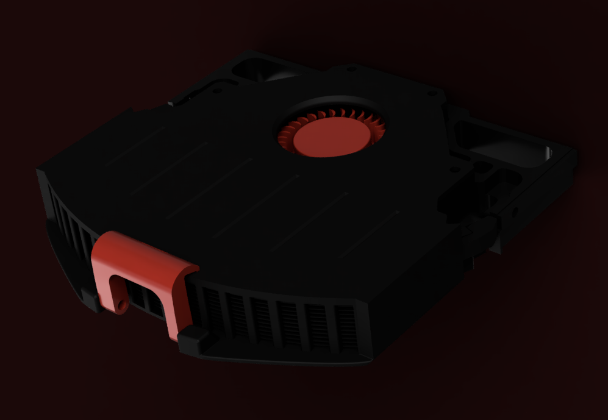

<!--
*** Thanks for checking out the Best-README-Template. If you have a suggestion
*** that would make this better, please fork the repo and create a pull request
*** or simply open an issue with the tag "enhancement".
*** Thanks again! Now go create something AMAZING! :D
-->

<!-- PROJECT SHIELDS -->
<!--
*** I'm using markdown "reference style" links for readability.
*** Reference links are enclosed in brackets [ ] instead of parentheses ( ).
*** See the bottom of this document for the declaration of the reference variables
*** for contributors-url, forks-url, etc. This is an optional, concise syntax you may use.
*** https://www.markdownguide.org/basic-syntax/#reference-style-links
-->

<!-- PROJECT LOGO -->
 

  <https://github.com/0ndsk4/VoronUsers/tree/0ndsk4/printer_mods/0ndsk4/Nevermore_Air_Filter/Nevermore_Micro/">
    
  </a>

  <h3 align="center">Nevermore Air Filter</h3>

  

    But the Raven, sitting lonely on the placid bust, spoke only 
That one word, as if his soul in that one word he did outpour. 
    Nothing farther then he uttered—not a feather then he fluttered— 
    Till I scarcely more than muttered “Other friends have flown before— 
On the morrow he will leave me, as my Hopes have flown before.” 
            Then the bird said “Nevermore!”  
			<B>"The Raven"</b>, Edgar Allan Poe
     
 
	  
    <https://github.com/0ndsk4/VoronUsers/tree/0ndsk4/printer_mods/0ndsk4/Nevermore_Air_Filter/Nevermore_Micro"><strong>Explore the Nevermore »</strong></a>
     
     
    <a href="https://github.com/0ndsk4/VoronUsers/tree/0ndsk4/printer_mods/0ndsk4/Nevermore_Air_Filter/Nevermore_Micro">Nevermore Air Filter</a>
    ·
    <a href="https://github.com/0ndsk4/VoronUsers/tree/0ndsk4/printer_mods/0ndsk4/Nevermore_Air_Filter/Nevermore_Micro/issues">Report Bug</a>
    ·
    <a href="https://github.com/0ndsk4/VoronUsers/tree/0ndsk4/printer_mods/0ndsk4/Nevermore_Air_Filter/Nevermore_Micro/issues">Request Feature</a>
  

<!-- TABLE OF CONTENTS -->

  
Table of Contents

  <ol>
    <li>
      <a href="#About-The-Nevermore">About The Nevermore</a>
      <ul>
        <li><a href="#Why">Why Nevermore?</a></li>
      </ul>
    </li>
    <li>
      <a href="#getting-started">Getting Started</a>
      <ul>
        <li><a href="#BOM">BOM</a></li>
        <li><a href="#installation">Installation</a></li>
		<li><a href="#Built-with">Built with</a></li>
      </ul>
    </li>
    <li><a href="#contributing">Contributing</a></li>
    <li><a href="#license">License</a></li>
  </ol>

<!-- ABOUT THE PROJECT -->
## About The Nevermore Micro

 

<B>NEVERMORE V4</B> 
Nevermore V4 is a refinement of the V3. Some supports for the plenum are back unfortunately, but they should be easy enough to remove(integrated, so no slicer supports anywhere!) V4 adds a air guides, as the previous versions had the majority of air flow on just one side of the filter. The cartridge lid also mounts a bit sturdier, and V4 now has separate base pieces for use with vorons other than 2.4.

<B>NEVERMORE V3</B> 
Nevermore V3 is a refinement of the V2. Gone are all supports, gone are the latch, lip and snap-fits (which due to the corner cubes made inserting the filter harder than it should be). Added is a 1.75mm slot between cartridge and plenum for TPU filament (or any other circulat rubber seal in suitable dimensions), and magnet latching (8x 4x6mm magnets). A later revision will probably bring support for standard voron 6x3 at the expense of the seal. Choose between V2 and V3 as you please!  
What-the-raven is Nevermore Micro? Its the smallest member of the Nevermore <I>recirculation carbon filter</I> family,  aimed at cleaning the VOCs produced by the printer REPEATEDLY, instead of using a one-pass exhaust of ever decreasing efficiency. Being the sixth filter design in my filter ventures, I feel this is the quickest way to add recirculation filtration easily - all while managing a balanced noise level utilizing a single 5015 fan.

### Why

At the end of the day, a fresh single-pass filtered exhaust (at brand new) has perhaps 70% VOC removal efficiency while still exhausting 30% of the nasty. A recirculation filter achieving four passes at worn-in 50% efficiency would still remove 94% of the bas stuff. Or 99% at six passes!  
The number of passes you get all depends on how well you can seal your build chamber.  
Some will have a hard time achieving a good chamber seal, which creates the biggest drawback of recirculation filters - they're air flow neutral. Meaning, as nothing pulls air into the chamber, air can diffuse freely to the outside through any remaining gaps. And that air could be <i>zero per cent</I> cleaned... If you plan on using only a Nevermore Micro - be sure to seal your chamber as good as possible.  

<!-- GETTING STARTED -->
## Getting Started

You're ready to build a Nevermore Micro? Cool!

### BOM

<B>MADE FOR ABS/PC/PETG - USE A DECENTLY HEAT RESISTANT FILAMENT!</b>  

<B>FANS</b> 
* ONE 5015 BLOWER FAN, CUT UP SO ONLY THE FAN AND ITS PLASTIC BACKING + "SCREW EARS" REMAINS. We aim for removing the focused air stream and instead achieve an even pressure across all of the filter medium.

<B>PRINTED PARTS:</b> 
Nevermore Micro has Three main parts: <B>Base, Plenum</b>, and <B>Cartridge</B> (plus lids for the plenum/cartridge.  

* <b>Base</B> is mounted in the 130mm space between the bottom extrusions found on many vorons (designed for v2 originally). It’s seated with one m3 on each side, that screws into to a receiving 2020 M3 T-nut.  

*<b>Plenum</B> holds the cut up 5015 fan, and is seated with two m3 screws into the base (base has two recieving m3 4mm heat inserts) on each side 

*<b>Cartridge</B> holds the filter medium of your choice (made for 3-4mm air filter active carbon pellets, but feel free to filter with what you think works best!). It snaps onto the Plenum piece for easy and quick removal.

<B>BOLTS/INSERTS/MAGNETS:</b> 
* 4 X Heat inserts (M3,5x4mm, standard voron issue).  
-2 for seating plenum to base. 
-2 for seating plenum lid to plenum. 
-2 x m3 2020 T-Nuts 
* 8 x 4x6 mm cylindrical magnets. 

* M3 SHCS/BHCS (6-10mm, use what works/looks best!)  

<B>Filter medium:</b> 
3-4mm Active carbon Air Filter Pellets (see Nevermore BOM for example links)

### Installation

1. Place 4 inserts (2 plenum, 2 on base). 
2. Remove support material from PLENUM  
3. Disassemble a 5015 fan (200+ Pa static pressure recommended), bu cutting it flat/circular (optionally use cutting guide stl). Seat it absolutely centered on the PLENUM HEX piece with a bit of glue or VHB tape (there should be 1.6-2mm of clearance to the plenum lid to work with) and with the wires along the markings.  
4. Lead fan wire along to the cutout on the back, and then glue the hex piece to the plenum. It only fits one way. 
5. Glue 8 magnets (cylindrical 4x6mm) to the corresponding holes on the plenum and cartridge, so the pieces can snap together. Optionally add a strip of 1.75mm soft TPU filament for additional sealing in the corresponding slot between cartridge/plenum. 
6. Remove/lift you v2.4 bed so you can reach about 5-10cm underneath the front of the hot bed. 
7. Find a good location for the filter base. When everything is installed, you should be able to remove the cartridge without burning yourself on the bed, and the filter cartridge should not reach all the way to the printer doors. 
8. Seat the Base with 2 m3 bolts into two recieving extrusion T Nuts. 
9. Seat Plenum to Base with two m3 shcs bolts (6-10mm). 
10. Add LID Piece to Plenum with 4x m3 x 6mm (BHSC, back two with inserts, front two are just threaded). NOTE: The lid have to bent slightly while installing as the intake hole extends down and have to pass over the plenum vanes to get in place - dont't worry, it will fit fine, just dont break the vanes!  
11. Test cartride/plenum/base. The base should not move when snapping on/off cartridge. Tighten as necessary! 
12. Re-install your heated bed. 
13. Fill cartridge with filter medium, snap on, connect fan wire to mcu and activate in klipper -  
14. Enjoy active carbon recirculation. Keep your carbon stash air tight, and change cartridge every 30-40 hrs (tip: print two or more cartridge pieces for fast/quick filter swaps. Keep any unused fresh cartridges in an air tight bag. 

### Built with
The Voron nevermore Air Filter was modelled in Fusion 360.
* [Fusion 360](http://autodesk.com)

<!-- USAGE EXAMPLES -->

<!-- CONTRIBUTING -->
## Contributing

Please contribute! I'd like to incorporate VOC sensors, making the filter smart (running on low-noise mode at an acceptable VOC level, then ramp up at the end to clean more thoroughly before doors open).

<!-- LICENSE -->
## License

Distributed under GNU General Public License version 3.0 (GPLv3)

<!-- CONTACT -->
## Contact

0ndsk4#5933  - (http://discord.com/user/0ndsk4#5933)  
Nevermore: [https://github.com/0ndsk4/VoronUsers/tree/0ndsk4/printer_mods/0ndsk4/Nevermore_Air_Filter](https://github.com/0ndsk4/VoronUsers/tree/0ndsk4/printer_mods/0ndsk4/Nevermore_Air_Filter)

<!-- ACKNOWLEDGEMENTS -->
## Acknowledgements
* [The Voron Dev Team](https://vorondesign.com/)

<!-- MARKDOWN LINKS & IMAGES -->
<!-- https://www.markdownguide.org/basic-syntax/#reference-style-links -->

[product-screenshot]: images/screenshot.png
